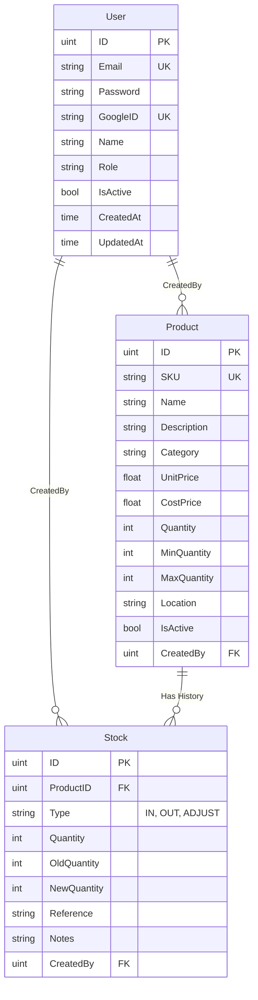

# Inventory Management Mini System

ระบบ Backend API สำหรับจัดการสินค้าคงคลังขนาดเล็ก พัฒนาด้วยภาษา Go โดยเน้นโครงสร้างแบบ Clean Architecture และมีประสิทธิภาพสูงด้วยการทำ Caching

## 🚀 ฟีเจอร์หลัก (Features)

*   **Authentication**:
    *   ลงทะเบียน (Register) และเข้าสู่ระบบ (Login) ด้วย Email/Password
    *   Google OAuth2 Authentication
    *   ระบบ Token-based Authentication (JWT)
*   **Product Management**:
    *   เพิ่ม, ลบ, แก้ไข, และดูรายการสินค้า (CRUD)
    *   รองรับการค้นหาและ Pagination
*   **Stock Management**:
    *   จัดการรายการรับเข้า (Stock In) และเบิกออก (Stock Out)
    *   ดูประวัติการเคลื่อนไหวของสต็อก (Stock History)
*   **Performance**:
    *   Caching ข้อมูลสินค้าด้วย **Redis** เพื่อลดภาระของ Database
*   **Documentation**:
    *   มี API Documentation ด้วย **Swagger UI**

## 🛠️ เทคโนโลยีที่ใช้ (Tech Stack)

*   **Language**: [Go](https://go.dev/) (v1.24+)
*   **Web Framework**: [Gin Gonic](https://github.com/gin-gonic/gin)
*   **Database**: [PostgreSQL](https://www.postgresql.org/)
*   **ORM**: [GORM](https://gorm.io/)
*   **Cache**: [Redis](https://redis.io/)
*   **Documentation**: [Swagger](https://github.com/swaggo/swag)
*   **Container**: [Docker](https://www.docker.com/) & Docker Compose

## 📋 ข้อกำหนดเบื้องต้น (Prerequisites)

*   [Docker](https://www.docker.com/products/docker-desktop) และ Docker Compose (แนะนำ)
*   [Go](https://go.dev/dl/) version 1.24+ (สำหรับรันแบบ Local)

## ⚙️ การติดตั้งและรันโปรเจกต์ (Installation & Running)

### วิธีที่ 1: รันด้วย Docker (แนะนำ)

1.  **Clone โปรเจกต์**
    ```bash
    git clone https://github.com/impk123/Inventory-Management-Mini-System.git
    cd Inventory-Management-Mini-System
    ```

2.  **ตั้งค่า Environment Variables**
    ```bash
    cp .env.example .env
    ```
    *   แก้ไขไฟล์ `.env` หากต้องการเปลี่ยนค่า Config ต่างๆ (เช่น Google Client ID/Secret)

3.  **รันด้วย Docker Compose**
    ```bash
    docker-compose up -d --build
    ```
    *   คำสั่งนี้จะสร้าง Container สำหรับ App, PostgreSQL, และ Redis

4.  **ตรวจสอบสถานะ**
    *   Server จะรันอยู่ที่: `http://localhost:8080`

### วิธีที่ 2: รันแบบ Local

1.  ตรวจสอบว่ามี PostgreSQL และ Redis รันอยู่บนเครื่อง
2.  ติดตั้ง Dependencies
    ```bash
    go mod download
    ```
3.  รันโปรแกรม
    ```bash
    go run cmd/main.go
    ```

## 📚 API Documentation

สามารถเข้าดูและทดสอบ API ผ่าน Swagger UI ได้ที่:

> **[http://localhost:8080/swagger/index.html](http://localhost:8080/swagger/index.html)**

*(ต้องรัน Server ก่อนใช้งาน)*

## �️ Database Schema

โครงสร้างฐานข้อมูลและความสัมพันธ์ระหว่างตาราง (ER Diagram)



## �📂 โครงสร้างโปรเจกต์ (Project Structure)

```
Inventory-Management-Mini-System/
├── cmd/                # Entry point ของโปรแกรม
├── internal/           # Business Logic หลัก
│   ├── config/         # การตั้งค่าระบบ (Env, DB)
│   ├── handlers/       # HTTP Handlers (Controller)
│   ├── models/         # Struct และ DB Models
│   ├── repositories/   # Data Access Layer
│   ├── routes/         # การกำหนด Route ของ Gin
│   └── services/       # Business Logic Layer
├── pkg/                # Packages เสริม (Utils, Middleware)
├── docs/               # Swagger Documentation Files
├── docker-compose.yml  # Docker Compose Config
└── README.md           # เอกสารช่วยสอน
```

---
Developed by You
