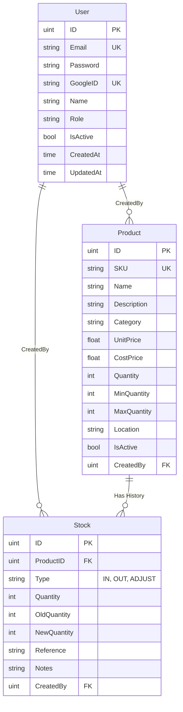

# Database Schema & ER Diagram

## ER Diagram

ภาพรวมความสัมพันธ์ระหว่างตารางในฐานข้อมูล (Entity-Relationship Diagram)

## ตาราง (Tables)

### 1. Users
เก็บข้อมูลผู้ใช้งานระบบ
*   **Relationship**: เป็นผู้สร้าง (Creator) ของ Product และ Stock Transaction

### 2. Products
เก็บข้อมูลสินค้าคงคลัง
*   **Relationship**:
    *   ถูกสร้างโดย User
    *   เป็นเจ้าของ Stock Transaction หลายๆ รายการ (One-to-Many)

### 3. Stocks
เก็บประวัติการเปลี่ยนแปลงจำนวนสินค้า (Transaction / Movement)
*   **Type**:
    *   `IN`: รับสินค้าเข้า
    *   `OUT`: เบิกสินค้าออก
    *   `ADJUST`: ปรับปรุงสต็อก (กรณีของหาย/พัง)
*   **Relationship**:
    *   ผูกกับ Product ตัวใดตัวหนึ่ง
    *   บันทึกว่า User คนไหนเป็นคนทำรายการ
